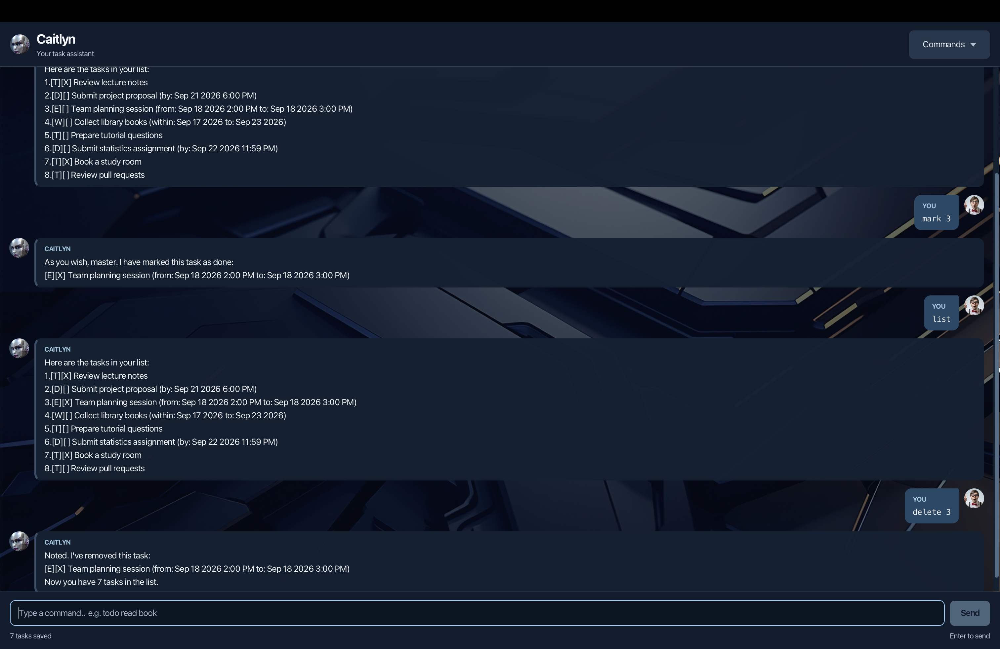

# Caitlyn User Guide

Caitlyn is your desktop task assistant: a polite butler for your slightly less polite workload. Keep track of to-dos, deadlines, events, and tasks you can complete within a date window by typing simple commands.



[Quick start](#quick-start) · [Features](#features) · [Dates and times](#dates-and-times) · [Saving and troubleshooting](#saving-and-troubleshooting)

## Quick start

1. Set up **Java 25 with JavaFX**. See the [project setup instructions](../README.md#setting-up-in-intellij) if you have not set up the project yet. On macOS with SDKMAN, select it with `sdk use java 25.0.3.fx-zulu`.
2. Open a terminal in the project folder and run `./gradlew run` (`gradlew.bat run` on Windows). Caitlyn's window opens. To run a packaged JAR instead, follow the [JAR instructions](../README.md#building-and-running-a-fat-jar).
3. Type `todo Review lecture notes` in the command box, then press **Enter** or click **Send**. Caitlyn confirms the new task and updates the saved task count.
4. Enter `list` to see your tasks. Try `mark 1` to complete the first task.

Need a syntax reminder? Click **Commands** and choose an example. It fills the command box so you can edit it before sending. You can resize the window, scroll through earlier replies, or right-click a message and choose **Copy message**.

## Features

Enter one command at a time. Command names and markers such as `/by` are **lowercase**. In the formats below, replace uppercase placeholders with your own text; do not type the placeholders. Descriptions may contain spaces and need no quotation marks. Keep the date markers in the order shown.

### Add a to-do

Use a to-do for something without a date. Give that “I should really do this” thought somewhere to live.

Format: `todo DESCRIPTION`

Example: `todo Review lecture notes`

Caitlyn adds an incomplete task shown as `[T][ ] Review lecture notes` and confirms the total number of tasks.

### Add a deadline

Use a deadline for something due by a particular date or time. Caitlyn will record it; negotiating an extension is still your department.

Format: `deadline DESCRIPTION /by DATE`

Example: `deadline Submit project proposal /by 2026-09-21 1800`

The new task appears as:

```text
[D][ ] Submit project proposal (by: Sep 21 2026 6:00 PM)
```

### Add an event

Use an event for an activity that takes place from a start to an end. Even a team meeting deserves an end time.

Format: `event DESCRIPTION /from START /to END`

Example: `event Team planning session /from 2026-09-18 1400 /to 2026-09-18 1500`

Caitlyn adds an `[E][ ]` task and displays both times. Include a full date at each end, even for a meeting on the same day. The start must not be after the end; equal times are allowed. A date-only start begins at midnight, and a date-only end includes the entire day. Use `/from` followed by `/to` exactly once, separated from surrounding text by spaces or tabs.

### Within-period tasks

Use a within-period task for an action you can complete **once at any point during a window**, such as collecting library books. Pick them up once; no need to move into the library.

Format: `within DESCRIPTION /from START /to END`

Example: `within Collect library books /from 2026-09-17 /to 2026-09-23`

The new task appears as:

```text
[W][ ] Collect library books (within: Sep 17 2026 to: Sep 23 2026)
```

Both boundaries are inclusive. A date-only start begins that day; a date-only end includes the whole day. You can mix dates and date-times. Equal dates give a one-day window, and the start must not be after the end. Use `/from` followed by `/to` exactly once; these standalone markers cannot be part of the description.

### View your tasks

Command: `list`

Shows all tasks, including completed ones, in the order you added them. If you add the four examples above to an empty list, the first two entries are:

```text
1.[T][ ] Review lecture notes
2.[D][ ] Submit project proposal (by: Sep 21 2026 6:00 PM)
```

The first number identifies the task. `[T]`, `[D]`, `[E]`, and `[W]` mean to-do, deadline, event, and within-period task. `[ ]` means incomplete; `[X]` means complete. An empty list shows only the reply heading.

### Find tasks

Remember “project” but not where you put it? Caitlyn can rummage through the list for you.

Format: `find KEYWORD`

Example: `find project`

Finds descriptions containing the text, ignoring letter case. The example finds “Submit project proposal”. Partial words also match; multiple words are searched as one phrase. Dates and task types are not searched. No matches means the reply contains only its heading.

Results keep their **original task numbers**, so a result labelled `2.` is still task 2 when you mark or delete it.

### Complete or reopen a task

Finished? Enjoy your little victory. Celebrated too early? `unmark` understands.

| Action | Format | Example | Result |
| --- | --- | --- | --- |
| Complete a task | `mark NUMBER` | `mark 1` | Changes task 1 to `[X]`. |
| Reopen a task | `unmark NUMBER` | `unmark 1` | Changes task 1 back to `[ ]`. |

Use a positive task number from the latest list. Completion is manual for every task type; Caitlyn does not send reminders or automatically complete overdue tasks.

### Delete a task

Format: `delete NUMBER`

Example: `delete 1`

Removes task 1 and confirms the remaining count. **There is no undo or confirmation prompt.** Later tasks are renumbered, so use `list` again before choosing another number. To change a description or date, delete the old task and add its replacement; there is no edit command.

### End your session

Command: `bye`

Caitlyn says goodbye and disables command entry. Butler dismissed, tasks safely tucked away. The conversation stays visible until you close the window. Reopen Caitlyn to start another session; your saved tasks remain available.

## Dates and times

Use a real calendar date in any of these formats:

| Input style | Examples |
| --- | --- |
| Year-month-day | `2026-09-21` |
| Day/month/year | `21/9/2026` |
| Date with 24-hour time | `2026-09-21 1800`, `21/9/2026 1800` |
| Date with a colon in the time | `2026-09-21 18:00`, `21/9/2026 18:00` |
| ISO date-time | `2026-09-21T18:00` |

Caitlyn displays dates as `Sep 21 2026` and minute-precision times as `6:00 PM`. Events and deadlines also accept ISO seconds and fractional seconds, such as `2026-09-21T18:00:30.125`, displayed as `6:00:30.125 PM` without losing precision. Use minute precision for `within`, which rejects nonzero seconds or fractional seconds. Words such as `tomorrow`, times without dates, and timezone offsets are not supported. Past dates and duplicate tasks are allowed. Separate command names, date markers, and date/time parts with spaces or tabs. `/by`, `/from`, and `/to` must be standalone tokens; text such as `/bytecode` or `/fromage` can appear in descriptions.

## Saving and troubleshooting

Task changes save automatically to `data/duke.txt` inside the folder from which you launch Caitlyn. Start it from the same folder each time to load the same list. Conversation history is not saved. To back up your tasks, close Caitlyn and copy this file somewhere safe. Avoid opening the same task file in multiple app instances.

| Problem | What to do |
| --- | --- |
| A command is rejected | Read Caitlyn's error, check lowercase spelling, required descriptions and date markers, then correct the selected input and send again. Rejected commands leave your tasks unchanged. |
| A task number is invalid | Run `list` and choose an existing number starting from 1. |
| “I could not save your tasks to disk.” | Check that the launch folder and `data/duke.txt` are writable and that disk space is available, then retry. The failed change has been rolled back. |
| “Saved tasks unavailable · Changes disabled” | Close Caitlyn and back up `data/duke.txt`. Restore a valid backup or repair the file/access permissions, then restart. The protected session loads no tasks and blocks changes to preserve the original file; `list`, `find`, and `bye` still work. |
| Your saved list seems missing | Check that you launched from the usual folder. A missing save file starts a new empty list. |

Keep backups when changing app versions: older versions without `within` support cannot read `[W]` tasks and may overwrite their saved data. Use the current version for lists containing within-period tasks.

Older versions allowed events whose end preceded their start. These invalid saved events now trigger the protected session described above. Back up the file, correct those event boundaries, and restart. Caitlyn does not silently remove or rewrite them.
